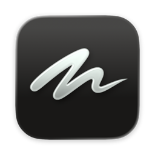
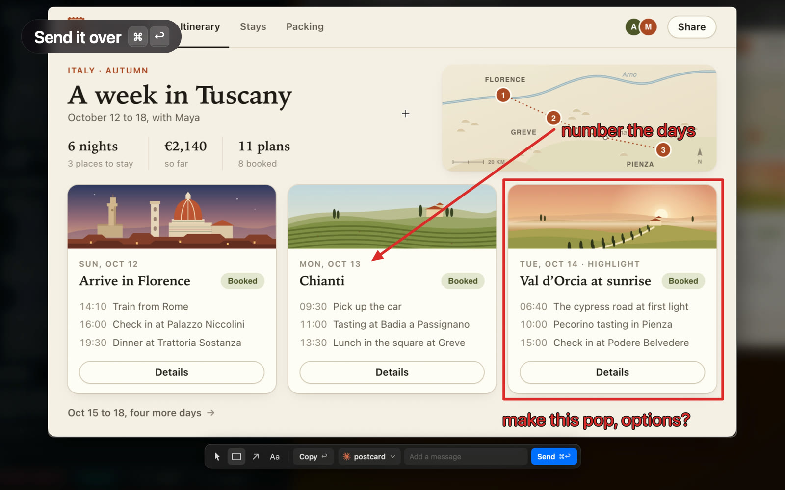

<p align="center">
  <a href="https://vignette.pete.design"></a>
  <br>
  <a href="https://vignette.pete.design"></a>
</p>

What if macOS's built-in screenshot tool continuing evolving after 2010 and was built with AI in mind? Meet Vignette.

Vignette is a free Mac menu bar app. It keeps your recent screenshots a double tap away, lets you
draw on them, and hands them to Claude Code or Codex, which can send you screenshots of their own.
You still take screenshots with Cmd+Shift+3, 4 and 5.

## Tour

[](https://vignette.pete.design)

[Watch the one-minute video](https://vignette.pete.design): draw on a screenshot, send it to Claude
Code, and pick from the options it sends back. Recorded live, with Claude's working time cut.

## What it does

### Capture

- **The same shortcuts**<br>
  Cmd+Shift+3, 4 and 5 still take the screenshot. Vignette's thumbnail appears in the bottom right
  corner in place of macOS's, with Copy and Delete on hover. Click it to draw.
- **Copies on capture**<br>
  Every screenshot lands on the clipboard.
- **Screen recordings too**<br>
  A recording from Cmd+Shift+5 gets a card with its length. Click it to play it.

### Recent screenshots

- **Screenshot history, one key away**<br>
  Use the Vignette shortcut (double-tap right Shift, by default) and a stack of your recent
  screenshots slides in from the right. A camera roll for screenshots. Arrows move, Space selects,
  Return opens.
- **One-click stitch**<br>
  Join several screenshots into one image. Each piece gets a number, and the layout stays readable
  after Claude shrinks the image.
- **Drag into a terminal**<br>
  Drag a card into Claude Code, a chat or Finder. A card you drew on drops the drawing.

### Drawing

- **Simple by design**<br>
  Three drawing tools: rectangle, arrow and text. No colour picker. Marks are red, and where red
  would be hard to see, Vignette picks a colour that stands out.
- **Notes and freehand arrows**<br>
  Type right after drawing a box or an arrow and a note starts beside it. Arrows follow your hand,
  and a nearly straight stroke draws a straight arrow.
- **Non-destructive**<br>
  Your drawing is kept in its own file, apart from the original. Go back, change it, undo it. The
  original stays as it was.
- **Queue**<br>
  Draw on several in a row. Open them together, and each one you copy or send opens the next.

### Coding agents

These features are experimental.

- **Your agent shows you things**<br>
  With the skill that ships with the app, Claude Code or Codex can put a screenshot in your stack
  with its own marks on it. You can change its marks like your own. Setup offers to install the
  skill, and Settings → Agents adds or removes it.
- **Send and Reply**<br>
  Send hands your drawing, with a message if you type one, to the Claude Code or Codex session you
  were just in. Click the session to pick another. On a screenshot from your agent, Reply sends
  your drawing straight back.
- **What Send needs**<br>
  Claude Code sessions need to be running in [herdr](https://herdr.dev), a terminal workspace for
  coding agents. Sending to Codex needs the `codex` command-line tool.

### The app

- **Native, refined feel**<br>
  The stack answers your keys without taking focus from the app you're in. Hold the shortcut and
  the newest shot lifts into the editor. Close it and you're back where you were.
- **Customizable and hackable**<br>
  Every setting lives in a file, every action is a URL, and the source is MIT licensed.

## Get it

**[Download Vignette](https://github.com/petekp/vignette/releases/latest)** for macOS 14 or later.
Open the disk image and drag Vignette to Applications. The app is notarized by Apple.

The first launch opens a short setup:

- If macOS saves your screenshots to the Desktop, Documents or Downloads, allow Vignette to read
  that folder. macOS asks once.
- Pick the shortcut. The double tap needs Accessibility permission. A key combination needs none.
- If Claude Code or Codex is installed, choose whether to add the agent skill.

Vignette turns off macOS's floating thumbnail and shows its own. Restore, in Settings →
Screenshots, puts macOS's screenshot settings back.

Or build it yourself:

```
git clone https://github.com/petekp/vignette.git
cd vignette
./scripts/run.sh
```

You need Xcode and `xcodegen`. [docs/building.md](docs/building.md) has the details,
including why macOS asks you to re-trust your own build for Accessibility after each rebuild, and
how a signing certificate avoids it.

## How it works

```
Cmd+Shift+4  ──►  <your screenshots folder>/Screenshot ….png
                        │
                        ▼  ScreenshotWatcher (DispatchSource on the folder)
                  ThumbnailController  ── bottom-right panel: fresh shot, or recent stack
                        │ Copy / Draw / Delete
                        ▼
                  AnnotationController ── window hosting EditorView, the drawing editor
                        │ Copy: the drawing, rendered off the main thread
                        ▼
                  Clipboard + "<name>-annotated.png" next to the original
```

Send takes the same rendering to an agent session instead (`ScreenshotRequests`,
`AgentConnection`). `Sources/` is the whole app, in Swift. The drawing editor is native AppKit, and
[docs/editor.md](docs/editor.md) says how it behaves.

## Guides

- [Using Vignette](docs/using.md): the recent stack, the annotator, the shortcut.
- [The drawing editor](docs/editor.md): the tools, the keys, the clipboard, the drawing file.
- [Commands](docs/commands.md): every action as a `vignette://` URL, the marks format, the log.
- [Settings](docs/settings.md): `settings.json`, the `ui` numbers, the tweaks panel.
- [Building](docs/building.md): build, sign, where things live, forking.
- [For agents](docs/agents.md): the skill that ships with the app and how it is installed.

`AGENTS.md` is the onboarding for anyone changing the app, person or agent. The dated notes in
`docs/` record the measurements and reasoning behind particular changes.

Vignette is MIT licensed.
